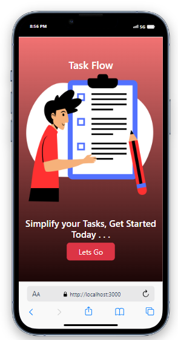

# React To-Do App

Welcome to my React To-Do App! This application helps you manage your tasks efficiently. It is built using React, Redux for global state management, React Hooks for component logic, and Bootstrap for styling.

## Features

- **Responsive:** The app is designed to adapt to various screen sizes, making it accessible on desktops, tablets, and smartphones.
- **Task Add Feature:** Easily add tasks to your to-do list.
- **Delete Feature:** Remove tasks from the list when they're no longer needed.
- **Complete Feature:** Mark tasks as complete to keep track of your progress.
- **Global State Management with Redux:** Utilizes Redux for managing the application's state globally, ensuring consistency across components.
- **React Hooks:** Utilizes React Hooks for component logic, providing a more concise and readable codebase.

## Screenshots

<div align="center">
    
    
</div>

<div align="center">
    
    
</div>

<div align="center">
    
    
</div>

## Installation

1. Clone the repository:

```bash
git clone https://github.com/yourusername/your-repository.git


## Available Scripts

In the project directory, you can run:

### `npm start`

Runs the app in the development mode.\
Open [http://localhost:3000](http://localhost:3000) to view it in your browser.

The page will reload when you make changes.\
You may also see any lint errors in the console.

